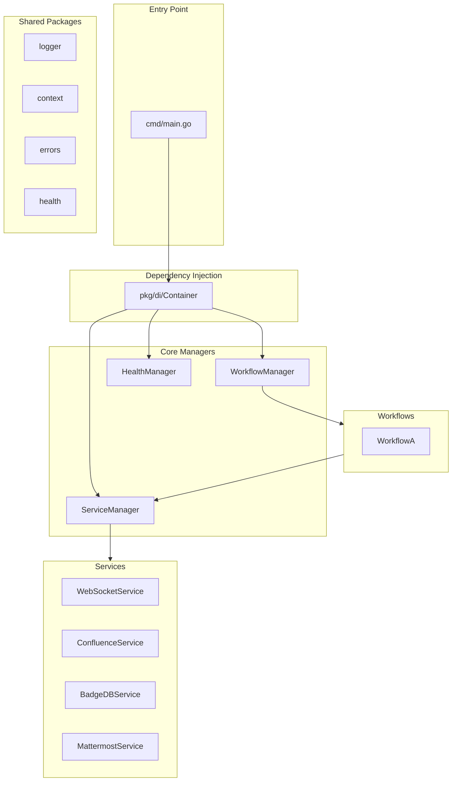

# Go Service Platform - System Memory

> A microservice workflow platform built with Go, designed for handling and coordinating message passing and business processes between different services.

## Quick Reference

| Aspect | Details |
|--------|---------|
| **Language** | Go 1.22.5+ |
| **Module** | `project` |
| **Entry Point** | `cmd/main.go` |
| **Port** | 8080 (Admin Server) |
| **Key Dependencies** | Logrus, Mattermost SDK, BigCache, go-cache |

---

## Architecture Overview



---

## Directory Structure

```
go-service-platform/
├── cmd/
│   └── main.go                 # Application entry point
├── config/                     # Configuration files
├── internal/
│   ├── config/                 # Service configuration definitions
│   │   ├── app_config.go
│   │   ├── confluence_config_loader.go
│   │   └── mattermost_config.go
│   ├── connections/            # Connection management
│   ├── dataaccess/             # Data access layer
│   │   └── cache_data_accessor.go
│   ├── interfaces/             # Interface definitions
│   │   ├── srvinterface.go     # ServiceManager interface
│   │   ├── workflow.go         # Workflow interface
│   │   ├── message_handler.go
│   │   └── health_checker.go
│   ├── manager/
│   │   ├── service_manager.go  # Service lifecycle management
│   │   └── workflow_manager.go # Workflow routing & dispatch
│   ├── messaging/              # Message processing
│   ├── model/
│   │   ├── badge.go            # Badge data model
│   │   ├── message.go          # Message data model
│   │   └── data.go
│   ├── service/
│   │   ├── base_service.go     # Common service functionality
│   │   ├── websocket_service.go
│   │   ├── confluence_service.go
│   │   ├── badgedb_service.go
│   │   └── mattermost_service.go
│   └── workflow/
│       ├── factories.go        # Workflow factory registration
│       ├── workflow_a.go       # Example workflow implementation
│       ├── workflow_definition.go
│       └── workflow_executor.go
├── pkg/
│   ├── concurrency/
│   ├── context/                # Application context with tracing
│   │   └── context.go          # AppContext with RequestID, TraceID, etc.
│   ├── di/
│   │   └── container.go        # Dependency injection container
│   ├── errors/
│   │   └── errors.go           # Custom error types (AppError)
│   ├── health/
│   │   ├── health.go           # Health check types
│   │   ├── checkers.go         # Built-in health checkers
│   │   ├── manager.go          # Health check manager
│   │   └── http.go             # HTTP health endpoints
│   ├── logger/
│   │   ├── logger.go           # Core logging functions
│   │   ├── context_logger.go   # Context-aware logging
│   │   ├── config.go           # Logger configuration
│   │   └── exporter.go         # Log export utilities
│   ├── metrics/
│   └── resilience/
│       ├── circuit_breaker.go  # (Placeholder)
│       └── rate_limiter.go     # (Placeholder)
└── go.mod / go.sum
```

---

## Core Components

### 1. Service Interface (`internal/service/Service.go`)

All services must implement:

```go
type Service interface {
    Start(ctx context.Context) error
    Stop(ctx context.Context) error
    GetName() string
    IsRunning(ctx context.Context) bool
}
```

### 2. BaseService (`internal/service/base_service.go`)

Provides common functionality for all services:
- Name, workflow, type tracking
- Thread-safe running state
- Health check registration
- Metrics collection

### 3. ServiceManager (`internal/manager/service_manager.go`)

Central service lifecycle management:
- `RegisterService(s Service)` - Register a service
- `StartAll(ctx)` / `StopAll(ctx)` - Batch lifecycle operations
- `GetServiceByName(ctx, name)` - Service discovery
- `GetServicesByWorkflowAndType(ctx, workflow, type)` - Filtered lookup
- `MonitorServices(ctx)` - Continuous health monitoring with auto-restart
- `ListServices(ctx)` - List all registered services

### 4. WorkflowManager (`internal/manager/workflow_manager.go`)

Workflow routing and message dispatch:
- `RegisterWorkflow(w Workflow)` - Register a workflow
- `DispatchMessage(ctx, msg)` - Route message to workflows
- `GetWorkflow(name)` / `GetWorkflowByName(ctx, name)` - Workflow lookup
- `ListWorkflows(ctx)` - List registered workflow names

### 5. DI Container (`pkg/di/container.go`)

Lazy-initialization dependency injection:
- `GetServiceManager(ctx)` - Get/create ServiceManager singleton
- `GetWorkflowManager(ctx)` - Get/create WorkflowManager singleton
- `GetHealthManager(ctx)` - Get/create HealthManager singleton
- `GetDataAccessor(ctx)` - Get/create DataAccessor singleton
- `RegisterServices(ctx)` - Register all configured services

---

## Implemented Services

### WebSocketService
- **Type**: `websocket`
- **Purpose**: External message reception
- **Key Methods**: `OnMessage(handler)`, `ProcessIncomingMessage(ctx, msg)`
- **Health Checks**: Connection count, last message time

### ConfluenceService
- **Type**: `confluence`
- **Purpose**: Confluence API integration with caching
- **Key Methods**: `FetchData(ctx)`, `Configure(ctx, config)`
- **Health Checks**: API connectivity, data freshness

### BadgeDBService
- **Type**: Global service
- **Purpose**: Badge/achievement management
- **Key Methods**: `GetProcessingMethod(type)`, `SaveBadge(ctx, badge)`, `GetBadge(ctx, id)`
- **Health Checks**: DB access, backup status

### MattermostService
- **Type**: `mattermost`
- **Purpose**: Mattermost integration

---

## Data Models

### Message (`internal/model/message.go`)
```go
type Message struct {
    ID        string
    Type      string
    Content   string
    UserID    string
    Timestamp time.Time
    Metadata  map[string]interface{}
}
```

### Badge (`internal/model/badge.go`)
```go
type Badge struct {
    ID          string
    Name        string
    Description string
    UserID      string
    AwardedAt   time.Time
    Type        string
    Attributes  map[string]interface{}
    Revoked     bool
    RevokedAt   time.Time
}
```

---

## Package Utilities

### Context (`pkg/context`)
Extended context with application fields:
- `NewContext(parent)` - Create with auto-generated RequestID
- `WithRequestID`, `WithTraceID`, `WithUserID`, `WithServiceName`, `WithOperationName`
- `GetRequestID`, `GetTraceID`, etc. - Retrieve values
- `FromRequest(r)` - Extract from HTTP headers (X-Request-ID, X-Trace-ID, X-User-ID)

### Logger (`pkg/logger`)
Structured JSON logging with Logrus:
- `InfoWithContext(ctx, msg)` - Context-aware logging
- `WithContextFields(ctx, fields)` - Add custom fields
- `WithContextError(ctx, err)` - Error logging
- `LogOperation(ctx, name, fn)` - Timed operation logging

**Environment Variables**:
- `LOG_LEVEL`: debug, info, warn, error, fatal, panic, trace
- `LOG_FORMAT`: json, text
- `LOG_TIME_FORMAT`: Timestamp format
- `LOG_CALLER_INFO`: true/false
- `LOG_OUTPUT`: stdout, stderr, or file path

### Errors (`pkg/errors`)
Typed application errors:
```go
// Types: TypeNotFound, TypeInvalidInput, TypeServiceUnavailable, 
//        TypeUnauthorized, TypeForbidden, TypeInternal, TypeTimeout

errors.New(TypeNotFound, "Resource not found", nil)
errors.Wrap(err, "Failed to process", TypeServiceUnavailable)
appErr.WithField("key", value)
```

### Health (`pkg/health`)
Health monitoring framework:
- **Statuses**: StatusUp, StatusDown, StatusDegraded, StatusUnknown
- **Levels**: LevelCritical, LevelWarning, LevelInfo
- **Built-in Checkers**: MemoryUsageChecker, GoroutineCountChecker, HTTPEndpointChecker

---

## Application Flow

### Startup Sequence (`cmd/main.go`)
1. Initialize logger from environment
2. Create root context with RequestID
3. Set up signal handling (SIGINT, SIGTERM, SIGQUIT)
4. Create DI container
5. Get ServiceManager, register services
6. Start all services
7. Start service monitoring (background)
8. Initialize WorkflowManager with factories
9. Set up message listeners (WebSocket → WorkflowManager)
10. Create and start admin HTTP server (:8080)

### Message Processing Flow
1. WebSocketService receives external message
2. Calls registered `messageHandler` callback
3. WorkflowManager.DispatchMessage routes to all workflows
4. WorkflowA processes message:
   - Queries BadgeDBService for processing method
   - Finds matching ConfluenceService
   - Fetches data from Confluence
   - Saves badge to BadgeDB

### Graceful Shutdown
1. Stop monitoring service
2. Shutdown HTTP server (5s timeout)
3. Stop all services (10s timeout per service)

---

## HTTP Endpoints

| Endpoint | Description |
|----------|-------------|
| `/health` | Health check with service status |
| `/services` | List all registered services |
| `/workflows` | List all registered workflows |

---

## Creating New Components

### New Service
1. Implement `Service` interface in `internal/service/`
2. Embed `*BaseService` for common functionality
3. Add custom health checkers via `AddHealthChecker()`
4. Register in `di/container.go` → `RegisterServices()`

### New Workflow
1. Implement `Workflow` interface in `internal/workflow/`
2. Create factory function: `func CreateMyWorkflow(sm *ServiceManager) (Workflow, error)`
3. Register factory in `workflow/factories.go` → `RegisterWorkflowFactories()`

---

## Testing

Existing test files:
- `internal/service/base_service_test.go`
- `internal/service/websocket_service_test.go`
- `pkg/logger/logger_test.go`
- `pkg/logger/context_logger_test.go`
- `pkg/logger/exporter_test.go`
- `pkg/context/context_test.go`
- `pkg/errors/errors_test.go`
- `pkg/health/health_test.go`
- `pkg/health/checkers_test.go`

Run tests:
```bash
go test ./...
```

---

## Build & Run

```bash
# Build
go build -o bin/service-workflow cmd/main.go

# Run with environment variables
LOG_LEVEL=debug LOG_FORMAT=json ./bin/service-workflow
```

---

## Key Design Patterns

1. **Dependency Injection**: Lazy singleton initialization in DI Container
2. **Factory Pattern**: Workflow creation via factory functions
3. **Interface Segregation**: Small, focused interfaces (Service, Workflow, Checker)
4. **Context Propagation**: All methods accept context for cancellation/tracing
5. **Graceful Degradation**: Service monitoring with auto-restart
6. **Structured Logging**: JSON logs with context fields
